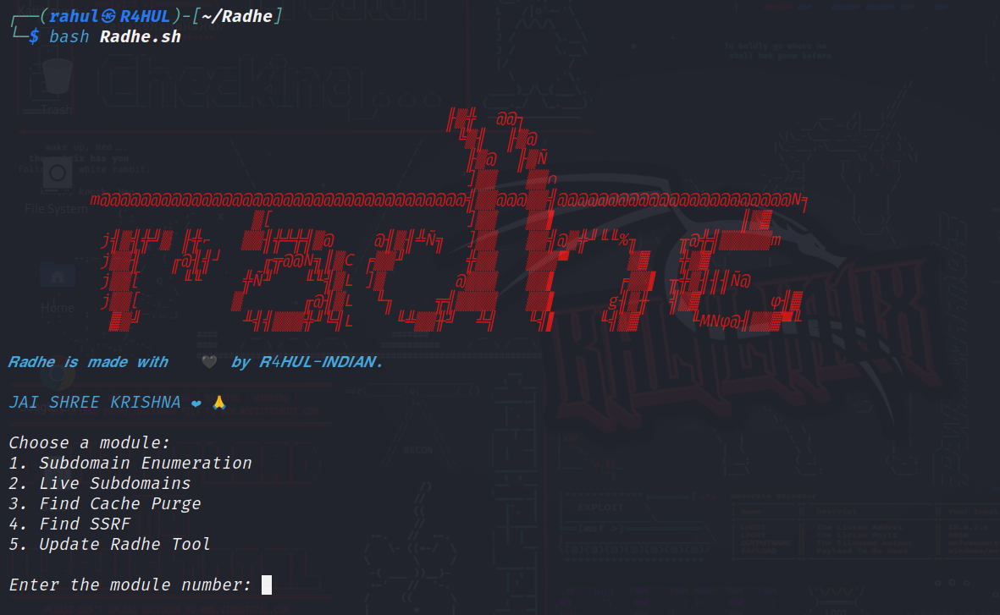

<h1 align="center">
  
  <br>
</h1>

𝗥𝗮𝗱𝗵𝗲 is a tool that automatically enumerates subdomains, checks if they are live, and finds "Unauthenticated cache purge" and "Server-Side Request Forgery (SSRF)" vulnerabilities or issues

# Features 

𝗥𝗮𝗱𝗵𝗲 is a tool that automatically enumerates subdomains, checks if they are live, and finds "Unauthenticated cache purge" and "Server-Side Request Forgery (SSRF)" vulnerabilities or issues. It has different modules that can be used for different tasks.

The following are the modules available in 𝗥𝗮𝗱𝗵𝗲:

- Subdomain Enumeration: This module enumerates all the subdomains of a given domain. It uses a variety of techniques to enumerate subdomains, including DNS brute force, passive DNS, and WHOIS lookups.

- Live Subdomains: This module checks if a given subdomain is live. It does this by trying to access the subdomain using a variety of methods, including HTTP, HTTPS, and Tools like Puredns, Httpx.

- Unauth Cache Purge: This module finds "Unauth cache Purge" issues. These are issues where a subdomain can be purged from a cache without authorization. This can be a security issue, as it can allow an attacker to delete sensitive data from a cache.

- SSRF Vulnerability Detection: The SSRF Vulnerability Detection module identifies potential Server-Side Request Forgery (SSRF) vulnerabilities. These vulnerabilities occur when an application allows unauthorized external requests to be made from the server-side, potentially exposing sensitive information or enabling attackers to interact with internal systems. Detecting and addressing SSRF vulnerabilities is crucial for maintaining the security and integrity of the application, preventing potential data leaks, and mitigating unauthorized access to sensitive resources.

Radhe is a powerful tool that can be used to find security vulnerabilities in a website. It is easy to use and can be run on any platform.

# Available On :

- 𝙇𝙄𝙉𝙐𝙓

- 𝙏𝙀𝙍𝙈𝙐𝙓

- 𝙒𝙄𝙉𝘿𝙊𝙒𝙎

# Radhe Installation

```
git clone https://github.com/R4HUL-INDIAN/Radhe/
cd Radhe
chmod +x Radhe.sh ssrf.py
```


# Running Radhe

This will Run 𝗥𝗮𝗱𝗵𝗲 Tool.

```
bash Radhe.sh 
or 
./Radhe.sh
```

<h1 align="left">

</h1>

𝑵𝑶𝑻𝑬: Use modules one by one. For example, the first module is Subdomain Enumeration, which creates a text file called "subdomains.txt". This file is used when running the second module, Live Subdomains. Therefore, all required files must be present before running any module. To use the modules correctly, run the first module, then the second module, and so on. (The fifth module, Update Radhe, does not require running any other modules before it.)

# Warning

𝙏𝙝𝙞𝙨 𝙩𝙤𝙤𝙡 𝙞𝙨 𝙤𝙣𝙡𝙮 𝙛𝙤𝙧 𝙚𝙙𝙪𝙘𝙖𝙩𝙞𝙤𝙣𝙖𝙡 𝙥𝙪𝙧𝙥𝙤𝙨𝙚. 𝙄𝙛 𝙮𝙤𝙪 𝙪𝙨𝙚 𝙩𝙝𝙞𝙨 𝙩𝙤𝙤𝙡 𝙛𝙤𝙧 𝙤𝙩𝙝𝙚𝙧 𝙥𝙪𝙧𝙥𝙤𝙨𝙚𝙨 𝙚𝙭𝙘𝙚𝙥𝙩 𝙚𝙙𝙪𝙘𝙖𝙩𝙞𝙤𝙣 𝙬𝙚 𝙬𝙞𝙡𝙡 𝙣𝙤𝙩 𝙗𝙚 𝙧𝙚𝙨𝙥𝙤𝙣𝙨𝙞𝙗𝙡𝙚 𝙞𝙣 𝙨𝙪𝙘𝙝 𝙘𝙖𝙨𝙚𝙨.


𝙍𝙖𝙙𝙝𝙚 𝙞𝙨 𝙢𝙖𝙙𝙚 𝙬𝙞𝙩𝙝 🖤 𝙗𝙮 𝙍4𝙃𝙐𝙇-𝙄𝙉𝘿𝙄𝘼𝙉.
